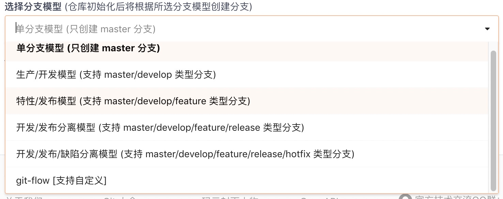

# Git的分支模型

参考原文推荐：

[A successful Git branching model](https://nvie.com/posts/a-successful-git-branching-model/)

## 1 概述

分支模型，是指在开发过程中多个分支进行协作的管理方式。这里的多个分支是为管理需要，只是名称在逻辑上的区分，本质上各个分支没有轻重主次的区别。

下图所示是gitee网站上创建仓库时提供的可选分支模型：

我们普遍使用的有以下几种分支：

- 主要分支：
  - master
  - develop
- 辅助分支：
  - feature
  - release
  - hotfix

这个图系统地体现了各分支之间的协作关系：

一个分支可以认为是一个被隔离的工作空间，master和develop是两个长期保留的工作空间，其它的工作空间根据需要随时创建，完成相应任务后，将工作成果合并到develop和maste上之后，就可以删除了。

## 2 主要分支

### 2.1 master分支
我们把正式发版的产品代码放到master分支中。master中的每一次提交，都对应产品的一个版本，HEAD总是最新的版本。

### 2.2 develop分支
是开发用的主要分支，HEAD反应了开发人员为开发下一版本所提交的最新状态。这个分支常用来进行每天晚上的自动构建。

### 2.3 合并时机

develop分支上的代码稳定之后，将要发版之时，将develop合并到master上，并打标签。合并使使用--no-ff选项，避免在master上生成大量的revision。（有时在将要发版时，会创建release分支，这时就不是develop分支直接向master合并，而是release分支分别向master和develop合并。）

每一次向master的合并，都是一次定义明确的发版，必须严格遵循这个约定。所以理论上讲，我们可以在master上加一个触发器，每次提交时，自动触发进行产品新版本的构建。

## 3 辅助分支

辅助分支是根据开发需要而创建的分支，它们的生命周期一般不会很长，用完（向master或develop分支合并后）就可以删除了。

辅助分支都是为一个特定目的而创建的，而且，对于它们应该从哪个分支上创建及最后应该合并到哪个分支上，都有严格的约束。

### 3.1 feature分支

feather分支是为将来版本开发一个新的功能。

- 分支来源：develop
- 合并目标：develop
- 命名规则：feature/* 或者 feature-*

feature分支根据具体情况，可以只作为本地分支存在，也可以作为远程分支存在。

新功能开发完成后，合并到develop分支，确定在下一个版本中体现该功能。合并时也要使用--no-ff选项。

操作流程：

### 3.2 release分支

用来准备一个新版本的发布。当计划发布一个新版本，但develop分支还要继续开发下一版本时，就创建一个release分支来做为要发布的新版本的工作空间。

- 分支来源：develop
- 合并目标：master和develop
- 命名规则：release/* 或者 release-*

这个新版本发布后，一方面，要合并到master上，形成一个新的版本；另一方面，要把做的所有修改都合并到develop上。

在release分支的开发过程中，也可能多次向develop分支合并修复的bug。

如果要发布新版本时，没有同时进行下一版本的开发，就没有必要新建release分支，直接在develop分支上进行即可。等完成发版的测试工作，确定要发版后，把develop分支合并到master上。

### 3.3 hotfix分支

对已发布版本的重要bug进行修复。

- 分支来源：master
- 合并目标：master和develop
- 命名规则：hotfix/* 或者 hotfix-*

比如已经发布上线版本v1.0，develop分支上正在进行版本v2.0的开发工作。此时v1.0发现一个重要bug需要修改，我们就需要从v1.0版出发创建分支hotfix/editname，在此hotfix分支修复bug后，合并hotfix分支到master分支并发布上线，同时也要把hotfix分支合并到develop分支。

有一个例外情况是，如果当前正有一个release分支进行中，那么hotfix分支应该合并到release分支上而不是develop分支，在release分支结束时，将修复一并合并到develop分支上。

## 4 总结

我们根据我们的项目特点进行分支模型的选择。比如很小的不常改动的项目，我们可以选择单分支模型：只有一个master分支。

比如我们的项目开发节奏是做完一个上线一个，我们就可以选择生产开发模型：develop分支+master分支。

